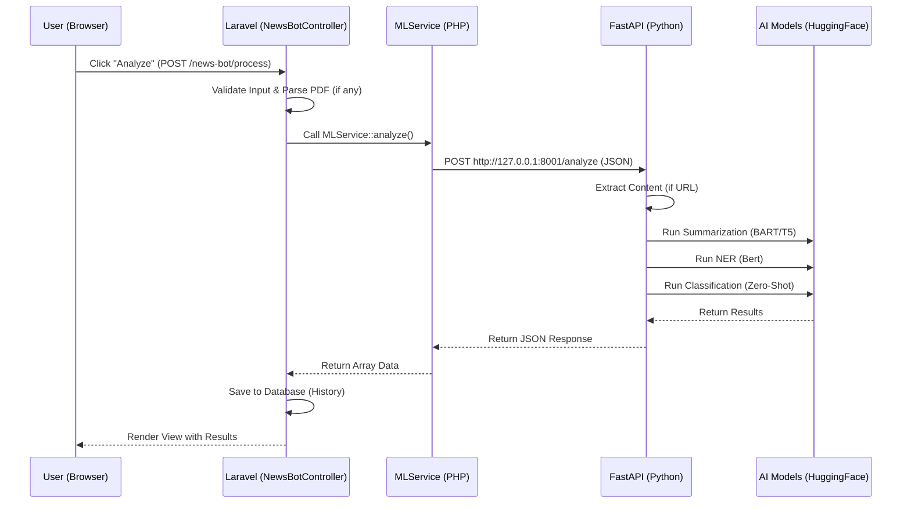

# AI Process Flow Architecture

This document details the end-to-end flow of the AI analysis feature in the **SumNer** application, from the user's interaction to the machine learning model execution and back.

## High-Level Architecture

The system uses a **Hybrid Architecture** combining:
1.  **Frontend**: Laravel Blade + Alpine.js (for interactivity).
2.  **Backend**: Laravel (PHP) for business logic, database, and user management.
3.  **ML Service**: FastAPI (Python) for heavy AI processing (Summarization, NER, Classification).



---

## Detailed Step-by-Step Flow

### 1. The Trigger: "Analyze" Button
**File**: `resources/views/news_bot_form_partial.blade.php`

- The user clicks the **Analyze Content** button.
- This triggers a standard HTML Form Submission (`POST`) to the route `{{ route('news.process') }}`.
- The form sends one of three inputs based on the selected tab:
    - `news_text`: Raw text paste.
    - `news_url`: A link to an article.
    - `news_pdf`: A PDF file upload.
- It also sends `summary_type` ("abstractive" or "extractive").

### 2. Laravel Controller Processing
**File**: `app/Http/Controllers/NewsBotController.php`

The `process` method handles the request:
1.  **Validation**: Ensures text, URL, or PDF is provided.
2.  **Preprocessing**:
    - If **PDF**: Uses `Smalot\PdfParser` to extract raw text from the file generally.
    - If **URL**: Passes the URL "as is" to the Python service (which handles scraping).
    - If **Text**: Passes raw text.
3.  **Service Call**: Calls `$this->mlService->analyze(...)`.

### 3. The Bridge: PHP to Python (JSON Payload)
**File**: `app/Services/MLService.php`

Laravel sends a standard HTTP POST request to the local Python service.

**Request Structure (JSON):**
```json
{
  "text": "The raw text content...",
  "url": "https://example.com/article" (optional),
  "summary_type": "abstractive",
  "parameters": {
    "user_preference_1": "value"
  }
}
```
*Note: If a URL is provided, `text` might be empty initially, as Python will fetch it.*

### 4. The AI Engine: FastAPI Implementation
**File**: `ml_service/main.py`

This is a continuously running Python process (port 8001).

#### A. Data Extraction
- If a `url` is provided, it uses the `newspaper3k` library to download and parse the article (Title, Body Text, Top Image).
- If `text` is provided, it uses that directly.

#### B. Model Execution (The "Brain")
The `ModelManager` (singleton) loads HuggingFace Transformers pipelines.

1.  **Summarization**:
    - **Abstractive**: Uses models like `facebook/bart-large-cnn` or `google/pegasus-xsum` to generate new sentences summarizing the text.
    - **Extractive**: Uses algorithms (like BERT-based scoring) to pick the most important existing sentences.
2.  **Named Entity Recognition (NER)**:
    - Uses models like `dslim/bert-base-NER` to find People (PER), Organizations (ORG), and Locations (LOC).
    - If the summary is too short, it runs NER on the *original* text to ensure no entities are missed.
3.  **Sentiment Analysis**:
    - Analyzes the tone (Positive/Negative/Neutral).
4.  **Zero-Shot Classification**:
    - Categorizes the article into topics (Politics, Tech, Sports, etc.) without needing specific training for those categories, looking at the semantic meaning.

#### C. The Response
FastAPI captures all results and returns a structured JSON:

**Response Structure (JSON):**
```json
{
  "summary": "This is the generated summary...",
  "entities": [
    {"word": "Elon Musk", "entity": "PER", "score": 0.99},
    {"word": "Tesla", "entity": "ORG", "score": 0.98}
  ],
  "sentiment": {
    "label": "POSITIVE",
    "score": 0.95
  },
  "category": "Technology",
  "title": "Extracted Article Title",
  "image_url": "https://example.com/image.jpg"
}
```

### 5. Storing & Displaying Results
**Back in Laravel (`NewsBotController.php`)**:

1.  The JSON response is decoded into a PHP Array.
2.  **Related News Generation**:
    - The controller looks at the extracted **Entities** (specifically `ORG` type) to generate a search query for related news (e.g., `"Tesla" OR "SpaceX"`).
3.  **History Saving**:
    - If the user is logged in, the result is saved to the `summarization_histories` table in the database.
4.  **rendering**:
    - The controller redirects back with the `results` session variable.
    - The Blade view checks `@if(session('results'))` and renders the "Analysis Results" section, showing the summary cards, charts, and entity tags.
